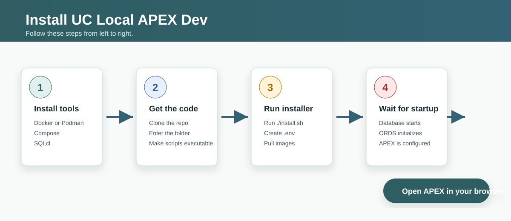
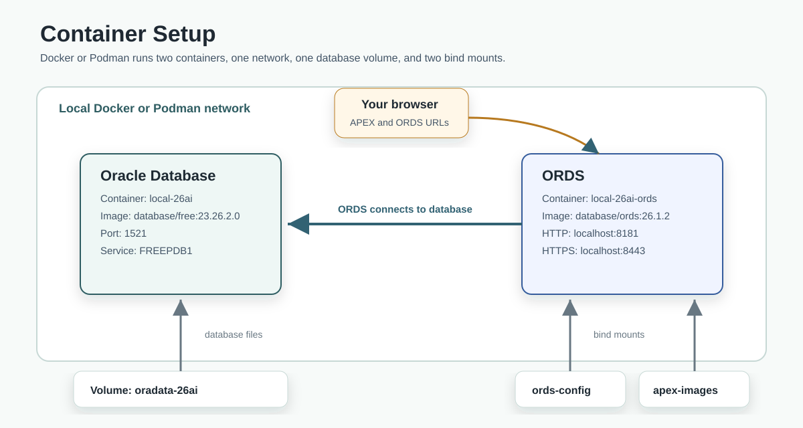

# UC Local APEX Dev

UC Local APEX Dev creates a local Oracle APEX development environment on your computer. It runs Oracle Database Free, Oracle APEX, and Oracle REST Data Services (ORDS) in containers. It also includes scripts for common local development tasks.

## Contents

- [Features](#features)
- [Installation Process](#installation-process)
- [Container Setup](#container-setup)
- [Documentation](#documentation)
- [Documentation Contents](#documentation-contents)
- [Source Code Contents](#source-code-contents)
- [Contributing](#contributing)
- [Special Thanks](#special-thanks)

> **Caution**
> This project is for local development only. Do not use it for production. It stores passwords in plain text and relaxes security settings to make local development easier.

## Features

This section summarizes the main features of UC Local APEX Dev.

- Start and stop a local Oracle Database, APEX, and ORDS environment.
- Create database schemas and APEX workspaces.
- Save connections for SQLcl and the VS Code SQL Developer extension.
- Back up and restore schemas, workspaces, applications, and ORDS modules.
- Test APEX application installs and SQL scripts in a clean schema.
- Use PL/SQL debugging from VS Code SQL Developer.
- Run ORDS with local HTTPS by using self-signed certificates.

## Installation Process

This section shows the order of the first-time setup steps.

## Container Setup

This section shows how the local containers, ports, volume, and bind mounts fit together.

## Documentation

Use the documentation site for setup steps, task guides, and migration guides:

[UC Local APEX Dev Documentation](https://www.united-codes.com/products/uc-local-apex-dev/docs/)

## Documentation Contents

This section lists the Markdown and MDX documentation files in this repository.

| Name | Description |
| --- | --- |
| [Project README](readme.md) | Introduces the project and links to source and documentation content. |
| [Documentation README](docs/README.md) | Explains how to work on the documentation site. |
| [Documentation Home](docs/src/content/docs/index.mdx) | Introduces UC Local APEX Dev for first-time readers. |
| [Getting Started](docs/src/content/docs/getting-started/index.mdx) | Explains how to install and start the local environment. |
| [Common Tasks](docs/src/content/docs/getting-started/common-tasks.mdx) | Lists common container, ORDS, storage, account, import, and reset tasks. |
| [Creating Users](docs/src/content/docs/getting-started/creating-users.mdx) | Explains how to create schemas and APEX workspaces. |
| [Backups](docs/src/content/docs/getting-started/backups.mdx) | Explains backup and import commands. |
| [PL/SQL Debugging](docs/src/content/docs/getting-started/plsql-debugging.mdx) | Explains how to prepare PL/SQL debugging. |
| [Install Apps or Scripts](docs/src/content/docs/getting-started/install-apps-scripts.mdx) | Explains how to test APEX application exports and SQL scripts. |
| [Upgrade APEX](docs/src/content/docs/migrations/upgrade-apex.md) | Explains how to upgrade APEX. |
| [Migrate to 25.1](docs/src/content/docs/migrations/25-1.md) | Migration guide for release 25.1. |
| [Migrate to 25.2](docs/src/content/docs/migrations/25-2.md) | Migration guide from 25.1 to 25.2. |
| [Migrate to 25.3](docs/src/content/docs/migrations/25-3.md) | Migration guide from 25.2 to 25.3. |
| [Migrate to 26.1](docs/src/content/docs/migrations/26-1.md) | Migration guide from 25.3 to 26.1. |
| [Migrate to 26.2](docs/src/content/docs/migrations/26-2.md) | Migration guide from 26.1 to 26.2. |
| [Migrate to 26.3](docs/src/content/docs/migrations/26-3.md) | Migration guide from 26.2 to 26.3. |
| [FAQ](docs/src/content/docs/other/faq.md) | Answers common project questions. |
| [Podman on macOS](docs/src/content/docs/other/podman-on-mac.md) | Explains how to use Podman on macOS. |

## Source Code Contents

This section lists the source files in the repository and what each file is for. Generated files are not included.

| Name | Description |
| --- | --- |
| [`.github/fixtures/test_install.sql`](.github/fixtures/test_install.sql) | SQL fixture used by GitHub Actions tests. |
| [`.github/workflows/test-clean-install.yml`](.github/workflows/test-clean-install.yml) | GitHub Actions workflow for clean install tests. |
| [`.github/workflows/test-db-upgrade.yml`](.github/workflows/test-db-upgrade.yml) | GitHub Actions workflow for database upgrade tests. |
| [`.gitlab-ci.yml`](.gitlab-ci.yml) | GitLab CI configuration. |
| [`docker-compose.yml`](docker-compose.yml) | Defines the database and ORDS containers. |
| [`docs/astro.config.mjs`](docs/astro.config.mjs) | Configures the Astro Starlight documentation site. |
| [`docs/build-static-website.sh`](docs/build-static-website.sh) | Builds the static documentation site. |
| [`docs/src/content.config.ts`](docs/src/content.config.ts) | Defines the Starlight content configuration. |
| [`install.sh`](install.sh) | Runs the full local installation flow. |
| [`local-26ai.sh`](local-26ai.sh) | Provides the main command wrapper for local tasks. |
| [`setup.sh`](setup.sh) | Creates local environment configuration. |
| [`scripts/after-first-db-start.sh`](scripts/after-first-db-start.sh) | Runs database setup tasks after the first database start. |
| [`scripts/backup-all.sh`](scripts/backup-all.sh) | Backs up all project-created users. |
| [`scripts/backup-user.sh`](scripts/backup-user.sh) | Backs up one user. |
| [`scripts/clear-schema.sh`](scripts/clear-schema.sh) | Removes objects from a schema. |
| [`scripts/compress-space.sh`](scripts/compress-space.sh) | Compresses a schema tablespace. |
| [`scripts/create-self-signed-certificates.sh`](scripts/create-self-signed-certificates.sh) | Creates local self-signed certificates. |
| [`scripts/create-user.sh`](scripts/create-user.sh) | Creates a database user and optional APEX workspace. |
| [`scripts/dev/reset.sh`](scripts/dev/reset.sh) | Resets the local development environment. |
| [`scripts/disable-archive-logs.sh`](scripts/disable-archive-logs.sh) | Disables archive logging for local development. |
| [`scripts/disable-password-expiration.sh`](scripts/disable-password-expiration.sh) | Disables APEX workspace password expiration. |
| [`scripts/drop-user.sh`](scripts/drop-user.sh) | Drops a database user and related local resources. |
| [`scripts/fix-ws-group-ids.sh`](scripts/fix-ws-group-ids.sh) | Updates APEX workspace exports before import. |
| [`scripts/import-all.sh`](scripts/import-all.sh) | Imports all files from the import backup folder. |
| [`scripts/import-backup.sh`](scripts/import-backup.sh) | Imports one backup. |
| [`scripts/import-datapump.sh`](scripts/import-datapump.sh) | Imports a Data Pump dump. |
| [`scripts/install-dbms-cloud.sh`](scripts/install-dbms-cloud.sh) | Installs DBMS Cloud support. |
| [`scripts/shrink-space.sh`](scripts/shrink-space.sh) | Reclaims unused database space. |
| [`scripts/sql/drop_all.sql`](scripts/sql/drop_all.sql) | Drops objects from the current schema. |
| [`scripts/sql/drop_apex_apps.sql`](scripts/sql/drop_apex_apps.sql) | Drops APEX applications. |
| [`scripts/sql/drop_dp_tables.sql`](scripts/sql/drop_dp_tables.sql) | Drops Data Pump tables. |
| [`scripts/start.sh`](scripts/start.sh) | Starts the local environment. |
| [`scripts/stop.sh`](scripts/stop.sh) | Stops the local environment. |
| [`scripts/sync-backups-folder.sh`](scripts/sync-backups-folder.sh) | Synchronizes backup folders. |
| [`scripts/test-app-install.sh`](scripts/test-app-install.sh) | Tests an APEX application install. |
| [`scripts/test-script-install.sh`](scripts/test-script-install.sh) | Tests a SQL script install. |
| [`scripts/unexpire-accounts.sh`](scripts/unexpire-accounts.sh) | Unlocks expired APEX accounts. |
| [`scripts/upgrade-apex.sh`](scripts/upgrade-apex.sh) | Upgrades APEX in the local environment. |
| [`scripts/used-space.sh`](scripts/used-space.sh) | Shows database space usage. |
| [`scripts/util/create-datapump-directory.sh`](scripts/util/create-datapump-directory.sh) | Creates a Data Pump directory. |
| [`scripts/util/drop-sqlcl-connection.sh`](scripts/util/drop-sqlcl-connection.sh) | Removes a SQLcl connection. |
| [`scripts/util/generate_password.sh`](scripts/util/generate_password.sh) | Generates a password. |
| [`scripts/util/get_ws_settings.sh`](scripts/util/get_ws_settings.sh) | Reads workspace settings. |
| [`scripts/util/load_env.sh`](scripts/util/load_env.sh) | Loads environment variables. |
| [`scripts/util/read_user_names.sh`](scripts/util/read_user_names.sh) | Reads user names from configuration. |
| [`scripts/util/save-sqlcl-connection.sh`](scripts/util/save-sqlcl-connection.sh) | Saves a SQLcl connection. |
| [`scripts/util/user-exists-in-db.sh`](scripts/util/user-exists-in-db.sh) | Checks whether a user exists in the database. |
| [`scripts/util/user_in_env.sh`](scripts/util/user_in_env.sh) | Checks whether a user is listed in `.env`. |

## Contributing

Issues and pull requests are welcome. Improvements to the Bash scripts and documentation are especially helpful.

## Special Thanks

- The [contributors](https://github.com/United-Codes/uc-local-apex-dev/graphs/contributors).
- Connor McDonald for his blog post about [using Oracle Database Free disk space efficiently](https://connor-mcdonald.com/2023/12/18/the-ultimate-database-free-edition/).
- Tim Hall for the [`drop_all.sql`](https://oracle-base.com/dba/script?category=miscellaneous&file=drop_all.sql) script.
- Philipp Salvisberg for guidance on [using the PL/SQL debugger](https://gist.github.com/PhilippSalvisberg/2f2853bc7a95fa86d9de9c0deab10602).
- Scott Spendolini for his blog post about [adding self-signed certificates to ORDS](https://spendolini.blog/adding-ssl-to-your-ords-container).
- Matt Mulvaney for his blog post about [unexpiring ORDS accounts](https://mattmulvaney.hashnode.dev/unexpiring-the-ordspublicuser-user-for-apex).
- The Oracle Database team for providing an ARM image for Oracle Database.
- The ORDS team for providing an ARM image for ORDS.
